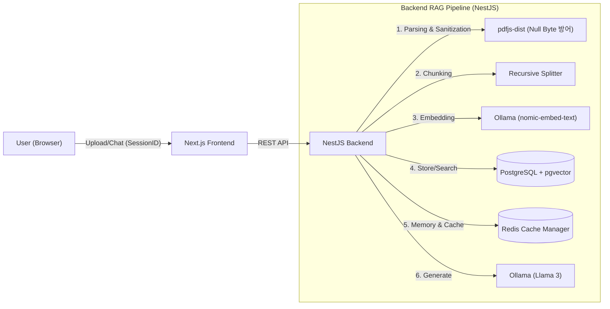

# 🏢 Local AI Office Automator (공사 행정 자동화 솔루션) `v1.2.0`

> **NestJS, LangChain, Redis 기반의 Full-Stack RAG(검색 증강 생성) 솔루션**
>
> 외부 유출이 민감한 공사 서류와 행정 업무를 **로컬 환경(On-Premise)** 의 AI(Llama 3)와 벡터 DB를 통해 안전하게 분석하고, 문맥을 이해하는 AI 비서와 대화할 수 있는 시스템입니다.


---

## 💡 프로젝트 소개

민감한 계약서나 사내 문서를 ChatGPT 같은 외부 클라우드에 올리는 것은 보안상 위험할 수 있습니다.
이 프로젝트는 **Llama 3와 Vector DB를 100% 로컬에서 구동**하여, 데이터 유출 없이 안전하게 문서를 분석하고 질의응답을 수행하는 **Full-Stack RAG 애플리케이션**입니다.

---

### 🌟 핵심 기능

1. **정교한 문서 분석:** 1000자 단위의 **Recursive Chunking**으로 문맥을 유지하며 PDF를 분석합니다.
2. **벡터 유사도 검색:** `pgvector`를 활용한 코사인 거리 연산으로 질문과 가장 연관성 높은 문서를 추출합니다.
3. **문맥 인식 및 캐싱(Redis):** **Redis 기반 세션 메모리**를 구현하여 AI가 이전 대화의 맥락을 기억하고, 동일 질문에 대한 빠른 캐시 응답을 제공합니다.
4. **환각 방지 및 데이터 정제:** 엄격한 프롬프트 엔지니어링을 적용하고, PDF 파싱 시 발생하는 보이지 않는 쓰레기 문자(Null Byte)를 정규식으로 차단하여 시스템 안정성을 높였습니다.

---

## 🏗 시스템 아키텍처 (Architecture)



---

## 🛠 기술 스택 (Tech Stack)

| Category          | Technology     | Decision Reason                                                                      |
| :---------------- | :------------- | :----------------------------------------------------------------------------------- |
| **Backend** | **NestJS** | 모듈형 아키텍처와 의존성 주입(DI) 패턴을 통해 유지보수성과 확장성이 뛰어난 서버 구축 |
| **Language** | **TypeScript** | 정적 타입 검사를 통해 런타임 에러를 사전에 방지하고 개발 생산성 향상                 |
| **Frontend** | **Next.js 14** | App Router 기반의 효율적인 라우팅과 React Server Component 활용                      |
| **Database** | **PostgreSQL** | 관계형 데이터와 벡터 데이터(`pgvector`)를 단일 DB에서 관리하여 운영 복잡도 감소      |
| **Cache & Memory**| **Redis** | 인메모리 처리로 사용자별 대화 세션의 빠른 조회 및 무거운 LLM 연산 결과 캐싱          |
| **AI / LLM** | **Ollama** | 외부 API 비용 없이 로컬 환경에서 고성능 LLM(Llama 3)을 안정적으로 구동               |
| **Orchestration** | **LangChain** | LLM과 애플리케이션 간의 데이터 흐름 및 프롬프트 체이닝(LCEL) 관리                    |

---

## 🔥 기술적 도전 및 트러블슈팅 (Key Technical Challenges)

개발 과정에서 직면한 주요 기술적 문제와 이를 해결한 과정입니다.

### 1. 긴 문서 처리 시 Context Limit 및 Timeout 문제
- **문제 상황:** 수십 페이지의 PDF를 한 번에 처리할 때 LLM의 토큰 제한(Context Window)을 초과하거나, 처리 시간 지연으로 `HeadersTimeoutError`가 발생.
- **분석:** 한국어는 영어 대비 토큰 밀도가 높아(약 3배), 모델의 기본 Context Window(2048~4096)를 쉽게 초과함.
- **해결:**
  1. **Recursive Chunking:** 문서를 1000자 단위(Overlap 200자)의 의미 있는 조각으로 분할.
  2. **Semantic Search:** 질문과 연관성 높은 상위 4개의 청크(`LIMIT 4`)만 선별 주입하여 정확도와 응답 속도 최적화.

### 2. 단일 사용자 환경에서의 세션 관리 및 성능 최적화
- **문제 상황:** HTTP 요청은 상태가 없으므로(Stateless), AI가 이전 질문을 기억하지 못함. 초기에는 인메모리 `Map` 객체를 썼으나, 서버 재시작 시 데이터가 증발하고 멀티 탭 동시성 처리에 취약함.
- **해결:** **Redis**를 도입하여 Frontend에서 생성한 UUID를 Key로 대화 객체(Chat History)를 격리 저장. 추가로 동일한 질문에 대해서는 LLM 추론을 생략하고 Redis에서 즉시 정답을 반환(Cache Hit)하도록 설계하여 API 응답 속도 극대화.

### 3. 이진 데이터(PDF) 파싱 중 발생하는 Null Byte(`\x00`) DB 삽입 장애
- **문제 상황:** PDF 내의 `ff` 같은 합자(Ligature) 폰트가 텍스트 추출 과정에서 깨지며, DB의 UTF-8 인코딩 규격에 어긋나는 제어 문자(`\x00`)로 변질됨. PostgreSQL이 이를 데이터 오염으로 간주하여 `invalid byte sequence` 에러를 뱉고 다운됨.
- **해결:** 텍스트를 청킹하기 직전, 정규 표현식(`replace(/[\u0000-\u0009\u000B-\u000C\u000E-\u001F\u007F]/g, '')`)을 활용해 보이지 않는 모든 쓰레기 제어 문자를 완벽하게 소독(Sanitization)하는 데이터 정제 필터 계층을 추가.

### 4. Docker 환경에서의 네트워크 격리 및 통신 장애
- **문제 상황:** 로컬 백엔드 서버에서 도커 컨테이너로 띄운 PostgreSQL에 접속하지 못하고 `Connection Refused` 발생.
- **해결:** 컨테이너 내부 통신망과 호스트(Local) 네트워크망의 개념을 분리. 로컬 개발 모드에서는 `localhost`와 외부 포트(`5433`)를 사용하고, 도커 컴포즈 운영 환경에서는 컨테이너 이름(`local_ai_db`)과 내부 포트를 사용하도록 환경 변수(`.env`)를 재설정하여 병목 해결.

### 5. 벡터 임베딩 차원(Dimension) 불일치
- **문제 상황:** `expected 1024 dimensions, not 4096` 에러 발생하며 DB 저장 실패.
- **분석:** Llama 3 모델은 4096차원을 출력하지만, DB 테이블은 1024차원으로 설계됨. (Schema와 Model의 불일치)
- **해결:** 임베딩 모델을 한국어 성능이 우수하고 차원 호환성이 맞는 `nomic-embed-text`로 분리 교체하여 아키텍처 정합성 확보.

---

## 🚀 시작하기 (Getting Started)

### 1. 사전 요구사항 (Prerequisites)
- Node.js v18 이상
- Docker Desktop (DB 및 Redis 구동용)
- Ollama 로컬 설치 및 모델 다운로드:
```bash
ollama pull llama3
ollama pull nomic-embed-text
```

### 2. 프로젝트 및 인프라 실행
```bash
git clone [https://github.com/munjuin/local-ai-office-automator.git](https://github.com/munjuin/local-ai-office-automator.git)
cd local-ai-office-automator

# PostgreSQL(pgvector) 및 Redis 컨테이너 실행
docker compose up -d
```

### 3. 백엔드 실행 (Backend)
```bash
cd backend
npm install

# .env 파일 설정 (DB, Redis, Ollama Host 포트 확인)
npm run start:dev
# 실행 확인: http://localhost:3000
```

### 4. 프론트엔드 실행 (Frontend)
```bash
cd ../frontend
npm install

npm run dev
# 실행 확인: http://localhost:3001
```

---

## 👤 Author

문주인 (Backend Developer)

- Vision: "바퀴를 다시 발명하지 말라지만, 원리를 이해하기 위해 다시 깎아보는 과정을 즐깁니다."
- Focus: Backend Architecture, Local AI, System Optimization
- Contact: raiawa1212@gmail.com
- GitHub: https://github.com/munjuin

---

## 📜 라이선스 (License)

MIT License
