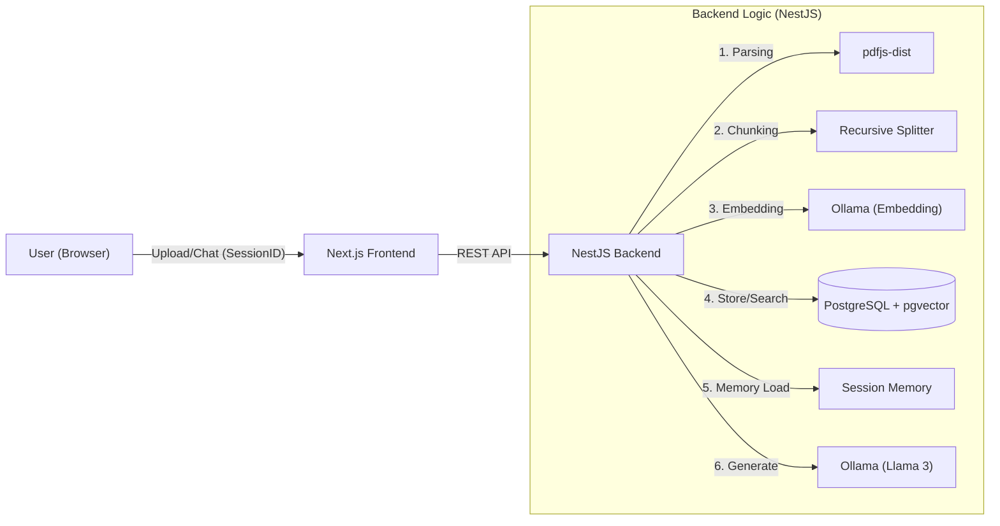

# 🏢 Local AI Office Automator (공사 행정 자동화 솔루션) `v1.0.0`

> **Next.js & NestJS 기반의 Full-Stack RAG(검색 증강 생성) 솔루션**
>
> 외부 유출이 민감한 공사 서류와 행정 업무를 **로컬 환경(On-Premise)** 의 AI(Llama 3)와 벡터 DB를 통해 안전하게 분석하고, 문맥을 이해하는 AI 비서와 대화할 수 있는 시스템입니다.


---

## 💡 프로젝트 소개

민감한 계약서나 사내 문서를 ChatGPT 같은 외부 클라우드에 올리는 것은 보안상 위험할 수 있습니다.
이 프로젝트는 **Llama 3와 Vector DB를 100% 로컬에서 구동**하여, 데이터 유출 없이 안전하게 문서를 분석하고 질의응답을 수행하는 **Full-Stack RAG 애플리케이션**입니다.

---

### 🌟 핵심 기능

1.  **정교한 문서 분석:** 1000자 단위의 **Recursive Chunking**으로 문맥을 유지하며 PDF를 분석합니다.
2.  **문맥 인식(Context Awareness):** **세션 기반 메모리**를 구현하여 AI가 이전 대화의 맥락을 기억합니다.
3.  **환각 방지:** 엄격한 프롬프트 엔지니어링으로 문서에 없는 내용은 지어내지 않도록 제어합니다.

---

## 🏗 시스템 아키텍처 (Architecture)



---

## 🛠 기술 스택 (Tech Stack)

| Category          | Technology     | Decision Reason                                                                      |
| :---------------- | :------------- | :----------------------------------------------------------------------------------- |
| **Backend**       | **NestJS**     | 모듈형 아키텍처와 의존성 주입(DI) 패턴을 통해 유지보수성과 확장성이 뛰어난 서버 구축 |
| **Language**      | **TypeScript** | 정적 타입 검사를 통해 런타임 에러를 사전에 방지하고 개발 생산성 향상                 |
| **Frontend**      | **Next.js 14** | App Router 기반의 효율적인 라우팅과 React Server Component 활용                      |
| **Database**      | **PostgreSQL** | 관계형 데이터와 벡터 데이터(`pgvector`)를 단일 DB에서 관리하여 운영 복잡도 감소      |
| **AI / LLM**      | **Ollama**     | 외부 API 비용 없이 로컬 환경에서 고성능 LLM(Llama 3)을 안정적으로 구동               |
| **Orchestration** | **LangChain**  | LLM과 애플리케이션 간의 데이터 흐름 및 프롬프트 체이닝 관리                          |

---

## 🔥 기술적 도전 (Key Technical Challenges)

개발 과정에서 직면한 주요 기술적 문제와 이를 해결한 과정입니다.

### 1. 긴 문서 처리 시 Context Limit 및 Timeout 문제

- **문제 상황:** 수십 페이지의 PDF를 한 번에 처리할 때 LLM의 토큰 제한(Context Window)을 초과하거나, 처리 시간 지연으로 `HeadersTimeoutError`가 발생.
- **분석:** 한국어는 영어 대비 토큰 밀도가 높아(약 3배), 모델의 기본 Context Window(2048~4096)를 쉽게 초과함.
- **해결:**
  1.  **Recursive Chunking:** 문서를 1000자 단위(Overlap 200자)의 의미 있는 조각으로 분할.
  2.  **Semantic Search:** 질문과 연관성 높은 상위 4개의 청크(`LIMIT 4`)만 선별 주입하여 정확도와 응답 속도 최적화.

### 2. Node.js 환경에서의 PDF 파싱 라이브러리 충돌

- **문제 상황:** `pdfjs-dist` 라이브러리 사용 시 `DOMMatrix is not defined` 에러 발생.
- **분석:** 해당 라이브러리가 브라우저 환경(Canvas, DOM API)을 가정하고 설계되어 Node.js 런타임과 호환되지 않음.
- **해결:** Dynamic Import를 통해 Node.js 호환 빌드(`legacy/build/pdf.mjs`)를 동적으로 로드하는 방식으로 해결.

### 3. 벡터 임베딩 차원(Dimension) 불일치

- **문제 상황:** `expected 1024 dimensions, not 4096` 에러 발생하며 DB 저장 실패.
- **분석:** Llama 3 모델은 4096차원을 출력하지만, DB 테이블은 1024차원으로 설계됨. (Schema와 Model의 불일치)
- **해결:** 임베딩 모델을 한국어 성능이 우수하고 1024차원을 지원하는 `nomic-embed-text` (혹은 `mxbai-embed-large`)로 교체하여 정합성 확보.

### 4. Llama 3의 영어 답변 고집 현상

- **문제 상황:** Llama 3 모델의 학습 데이터 특성상, 한국어 질문에도 영어로 답변하는 경향이 강함.
- **해결:** 단순한 프롬프트("한국어로 답해줘")로는 해결되지 않아, **System Instruction을 영어로 작성하여 한국어 출력을 강제**하는 역발상(Rule-based Enforcement) 적용.

### 5. Modern Node.js(ESM)와 라이브러리 호환성

- **문제 상황:** `type: module` 환경에서 Prisma Client 및 기타 CJS 라이브러리 로드 시 `MODULE_NOT_FOUND` 에러 발생.
- **해결:** `tsconfig.json`의 `moduleResolution`을 `NodeNext`로 설정하고, 명시적인 확장자(.js) 사용 및 일부 라이브러리는 안정적인 버전(Prisma v6)을 채택하여 환경 안정화.

---

## 🚀 시작하기 (Getting Started)

### 1. 사전 요구사항 (Prerequisites)

- Node.js v18 이상
- PostgreSQL (pgvector 확장 설치 필수)
- Ollama 모델 다운로드:

```bash
ollama pull llama3
ollama pull nomic-embed-text
```

### 2. 프로젝트 설치

```bash
git clone [https://github.com/munjuin/local-ai-office-automator.git](https://github.com/munjuin/local-ai-office-automator.git)
cd local-ai-office-automator
```

### 3. 백엔드 실행 (Backend)

```bash
cd backend
npm install

# .env 파일 설정 (DB 정보 확인)
# DB_HOST=localhost
# DB_PORT=5432 ...

npm run start:dev
# 실행 확인: http://localhost:3000
```

### 4. 프론트엔드 실행 (Frontend)

```bash
cd ../frontend
npm install

npm run dev
# 실행 확인: http://localhost:3001
```

---

## 👤 Author

문주인 (Backend Developer)

- Vision: "바퀴를 다시 발명하지 말라지만, 원리를 이해하기 위해 다시 깎아보는 과정을 즐깁니다."

- Focus: Backend Architecture, Local AI, System Optimization

- Contact: raiawa1212@gmail.com

- GitHub: https://github.com/munjuin

---

## 📜 라이선스 (License)

MIT License
